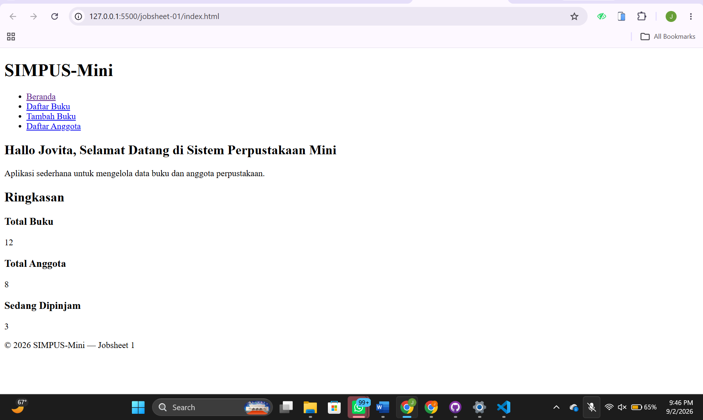
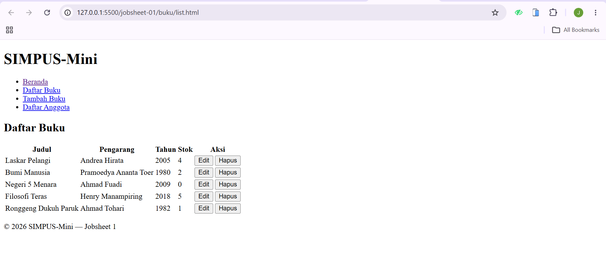
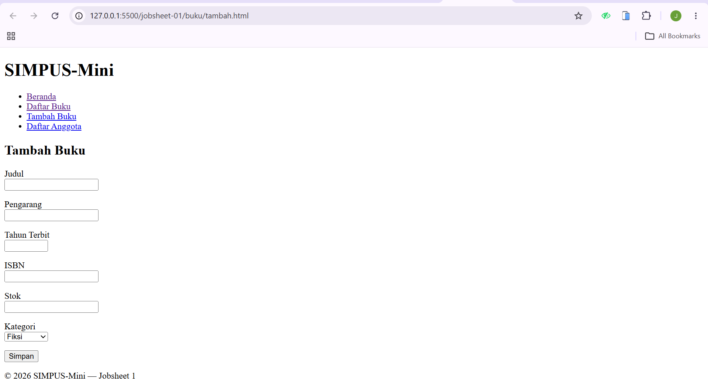
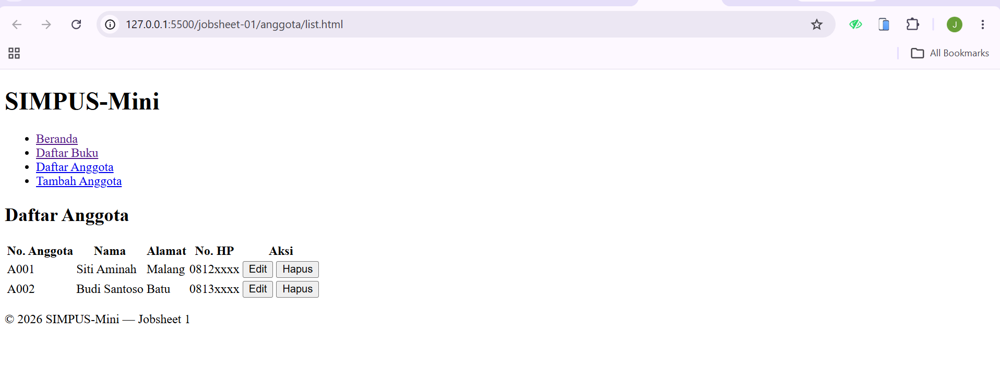
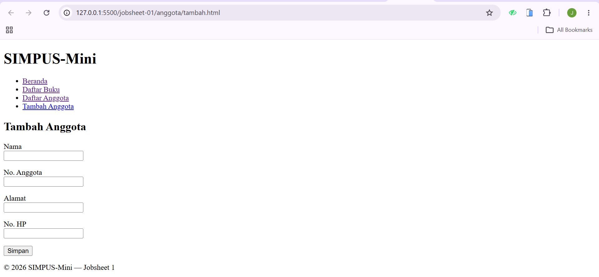

|  | Desain dan Pemrograman Web |
|--|--|
| NIM |  254107020022|
| Nama |  Jovita Maharani |
| Kelas | TI - 1F |
| Repository | [link] (https://github.com/jovitamaharani/AGS_2026/tree/main/src/p1) |

# Jobsheet 1 — HTML5 Semantic Skeleton

## halaman index/halaman awal

## halaman list buku

## halaman tambah buku

## halaman list anggota

## halaman tambah anggota
